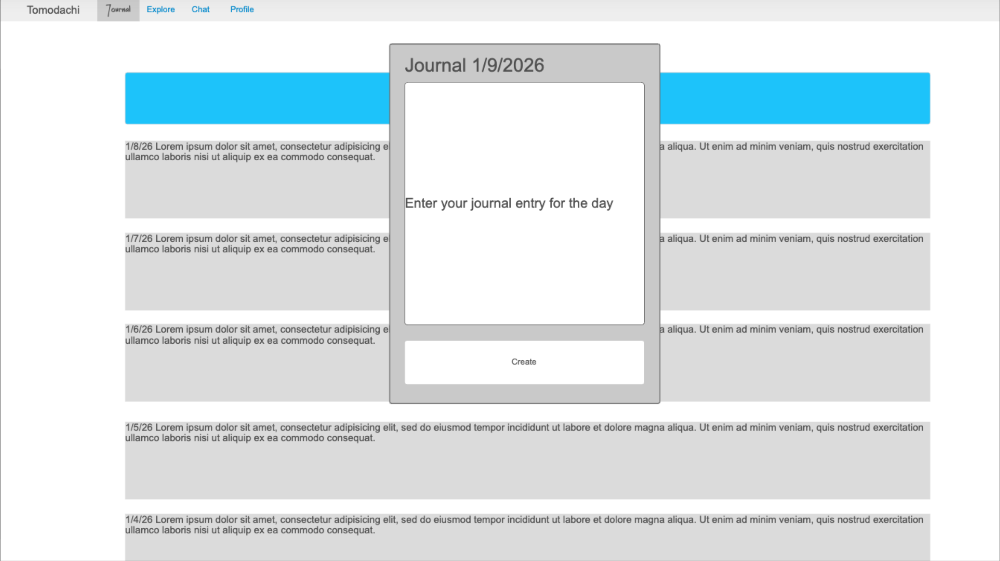
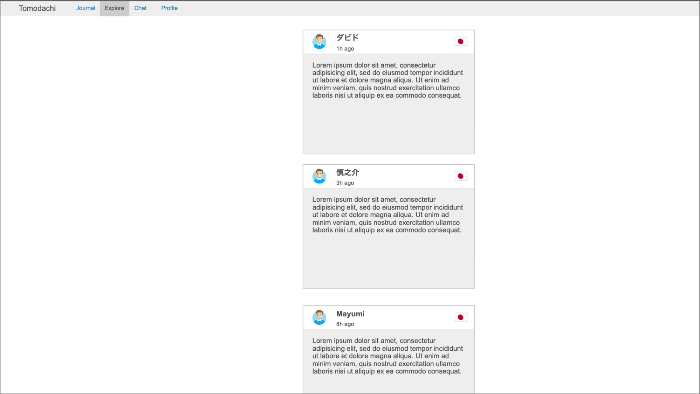
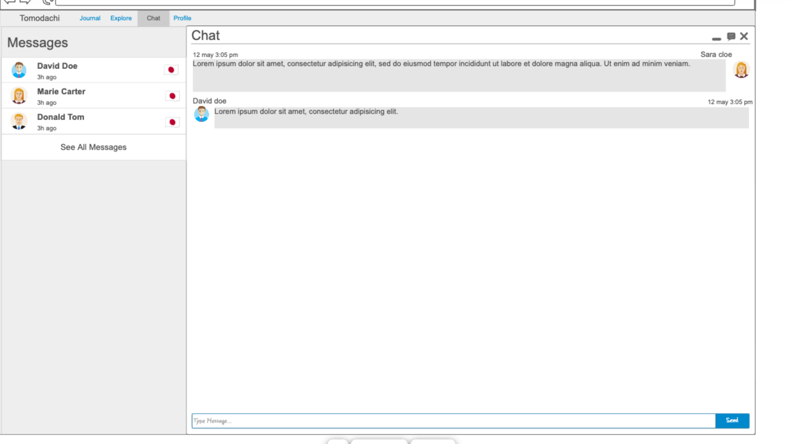

# Tomodachi

[My Notes](notes.md)

Tomodachi is a journal-sharing app that connects native Japanese speakers with native English speakers, and vice-versa. Users create deep relationships while allowing them to learn and practice Japanese, while gaining a deeper understanding of Japanese culture and life. Tomodachi also allows the same experience for users from Japan by helping them improve their English skills and learn what life outside of Japan is like.

## 🚀 Specification Deliverable

For this deliverable I did the following. I checked the box `[x]` and added a description for things I completed.

- [x] Proper use of Markdown
- [x] A concise and compelling elevator pitch
- [x] Description of key features
- [x] Description of how you will use each technology
- [x] One or more rough sketches of your application. Images must be embedded in this file using Markdown image references.

### Elevator pitch

Have you ever wanted to learn Japanese but don't know where to start? Or you want to improve your Japanese but are too busy? Or the conversations you've had on other language learning apps are shallow and go quiet quickly? Tomodachi solves those problems. Learn conversational Japanese by making friends from Japan through our journal-sharing feature. Our app will send you reminders so that you can spend 10 minutes or less if you're busy, or more time if you're free, to write journal entries and read journals from your friends. 

### Design

Home page:

Sign In page:

Sign Up page:

Journal page:

Explore page:

Chat page:

Profile page:

### Key features

- Total number of users from each country displayed
- Secure username / password / phone number with verification login over HTTPS
- Journal tab - make an entry
- Journal prompts - "what is life like in (your country)", "what are your goals and dreams?"
- Explore tab: see others' journal entries and their profile
- Chat tab: be able to chat 1 on 1 with the other user
- Profile tab: see the user's journal entries, follow, be able to heart or comment, see their connected Instagram or Facebook
- Sign out
- Delete Account
- Reporting: report suspicious users, ban their phone number

### Technologies

I am going to use the required technologies in the following ways.

- **HTML** - Use correct HTML structure for home page, login page, sign up page, journal page, explore page, chat page, profile page, and settings page.
- **CSS** - Application styling is sleek, works well on different screen sizes, and follows a consistent style and color palette
- **React** - Provides authentication pages, journaling, explore, chat, and profile pages as well. Displays live data such as journals, messages, and comments.
- **Service** - Backend service with endpoints for:
    - login
    - signup
    - create, read, update, and delete journal entries
    - create and read messages
    - create, read, update, and delete journal prompts
    - create, read, update, and delete blacklisted users
- **DB/Login** - Store registered users, user login sessions, chats, journal entries (along with likes and comments), store blacklisted users, and also journal prompts
- **WebSocket** - Update user chats when a message is sent within a chat

## 🚀 AWS deliverable

For this deliverable I did the following. I checked the box `[x]` and added a description for things I completed.

- [ ] **Server deployed and accessible with custom domain name** - [My server link](https://yourdomainnamehere.click).

## 🚀 HTML deliverable

For this deliverable I did the following. I checked the box `[x]` and added a description for things I completed.

- [ ] **HTML pages** - I did not complete this part of the deliverable.
- [ ] **Proper HTML element usage** - I did not complete this part of the deliverable.
- [ ] **Links** - I did not complete this part of the deliverable.
- [ ] **Text** - I did not complete this part of the deliverable.
- [ ] **3rd party API placeholder** - I did not complete this part of the deliverable.
- [ ] **Images** - I did not complete this part of the deliverable.
- [ ] **Login placeholder** - I did not complete this part of the deliverable.
- [ ] **DB data placeholder** - I did not complete this part of the deliverable.
- [ ] **WebSocket placeholder** - I did not complete this part of the deliverable.

## 🚀 CSS deliverable

For this deliverable I did the following. I checked the box `[x]` and added a description for things I completed.

- [ ] **Header, footer, and main content body** - I did not complete this part of the deliverable.
- [ ] **Navigation elements** - I did not complete this part of the deliverable.
- [ ] **Responsive to window resizing** - I did not complete this part of the deliverable.
- [ ] **Application elements** - I did not complete this part of the deliverable.
- [ ] **Application text content** - I did not complete this part of the deliverable.
- [ ] **Application images** - I did not complete this part of the deliverable.

## 🚀 React part 1: Routing deliverable

For this deliverable I did the following. I checked the box `[x]` and added a description for things I completed.

- [ ] **Bundled using Vite** - I did not complete this part of the deliverable.
- [ ] **Components** - I did not complete this part of the deliverable.
- [ ] **Router** - I did not complete this part of the deliverable.

## 🚀 React part 2: Reactivity deliverable

For this deliverable I did the following. I checked the box `[x]` and added a description for things I completed.

- [ ] **All functionality implemented or mocked out** - I did not complete this part of the deliverable.
- [ ] **Hooks** - I did not complete this part of the deliverable.

## 🚀 Service deliverable

For this deliverable I did the following. I checked the box `[x]` and added a description for things I completed.

- [ ] **Node.js/Express HTTP service** - I did not complete this part of the deliverable.
- [ ] **Static middleware for frontend** - I did not complete this part of the deliverable.
- [ ] **Calls to third party endpoints** - I did not complete this part of the deliverable.
- [ ] **Backend service endpoints** - I did not complete this part of the deliverable.
- [ ] **Frontend calls service endpoints** - I did not complete this part of the deliverable.
- [ ] **Supports registration, login, logout, and restricted endpoint** - I did not complete this part of the deliverable.

## 🚀 DB deliverable

For this deliverable I did the following. I checked the box `[x]` and added a description for things I completed.

- [ ] **Stores data in MongoDB** - I did not complete this part of the deliverable.
- [ ] **Stores credentials in MongoDB** - I did not complete this part of the deliverable.

## 🚀 WebSocket deliverable

For this deliverable I did the following. I checked the box `[x]` and added a description for things I completed.

- [ ] **Backend listens for WebSocket connection** - I did not complete this part of the deliverable.
- [ ] **Frontend makes WebSocket connection** - I did not complete this part of the deliverable.
- [ ] **Data sent over WebSocket connection** - I did not complete this part of the deliverable.
- [ ] **WebSocket data displayed** - I did not complete this part of the deliverable.
- [ ] **Application is fully functional** - I did not complete this part of the deliverable.
