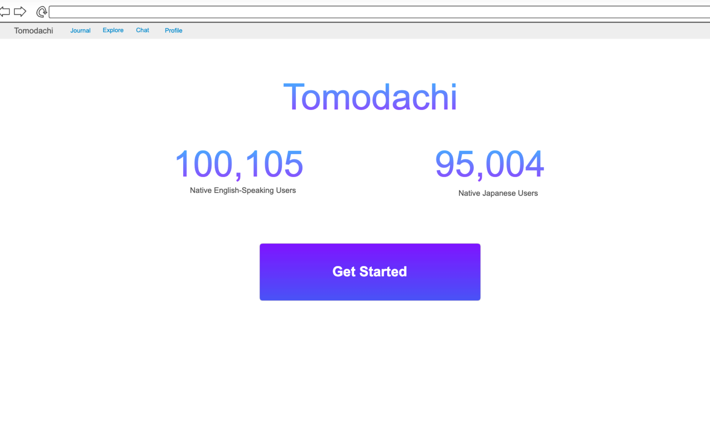
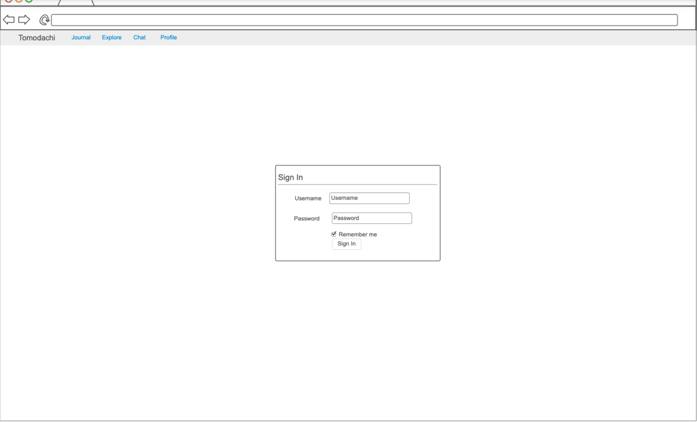
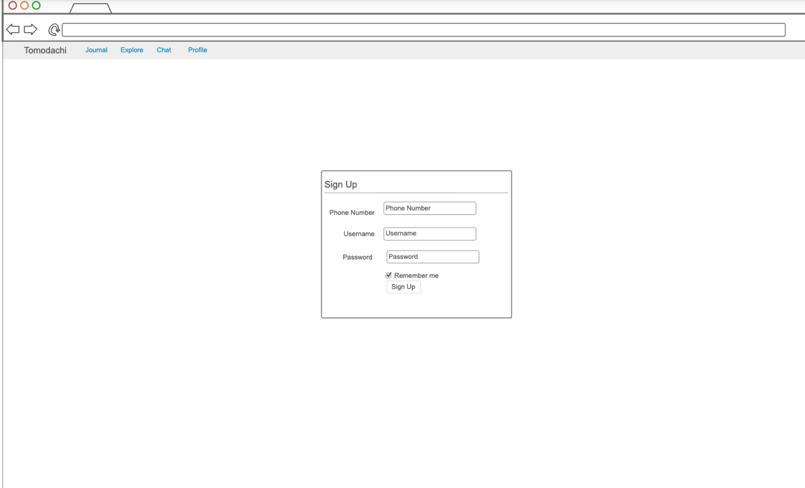
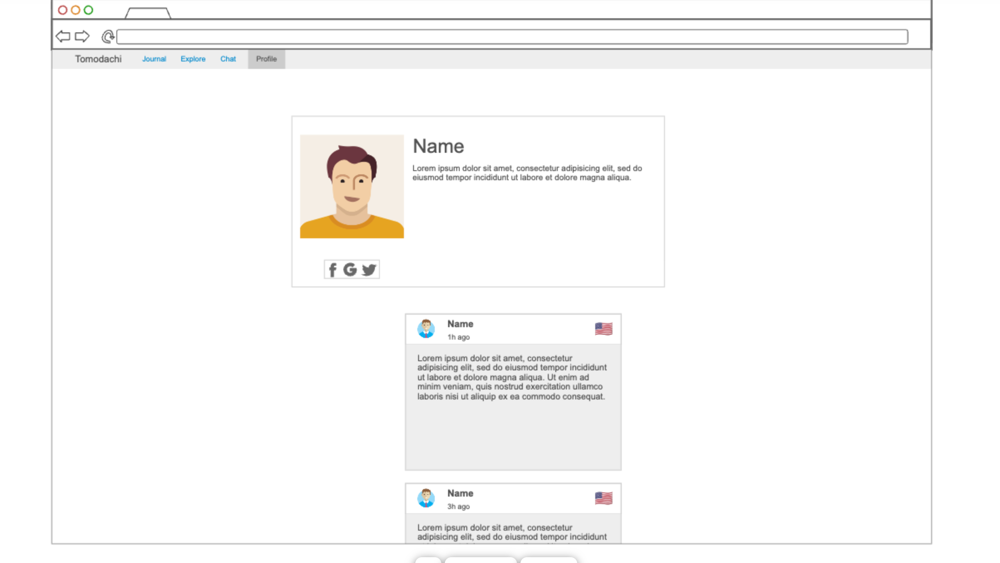

# Tomodachi

[My Notes](notes.md)

Tomodachi is a journal-sharing app that connects native Japanese speakers with native English speakers, and vice-versa. Users create deep relationships while allowing them to learn and practice Japanese, while gaining a deeper understanding of Japanese culture and life. Tomodachi also allows the same experience for users from Japan by helping them improve their English skills and learn what life outside of Japan is like.

## 🚀 Specification Deliverable

For this deliverable I did the following. I checked the box `[x]` and added a description for things I completed.

- [x] Proper use of Markdown
- [x] A concise and compelling elevator pitch
- [x] Description of key features
- [x] Description of how you will use each technology
- [x] One or more rough sketches of your application. Images must be embedded in this file using Markdown image references.

### Elevator pitch

Have you ever wanted to learn Japanese but don't know where to start? Or you want to improve your Japanese but are too busy? Or the conversations you've had on other language learning apps are shallow and go quiet quickly? Tomodachi solves those problems. Learn conversational Japanese by making friends from Japan through our journal-sharing feature. Our app will send you reminders so that you can spend 10 minutes or less if you're busy, or more time if you're free, to write journal entries and read journals from your friends. 

### Design

Home page:

Sign In page:

Sign Up page:

Journal page:

Explore page:

Profile page:

### Key features

- Total number of users from each country displayed
- Secure username / password / phone number with verification login over HTTPS
- Journal tab - make an entry
- Journal topics - "what is life like in (your country)", "what are your goals and dreams?"
- Explore tab: see others' journal entries, add your own
- Profile tab: see the user's journal entries and reads
- Sign out
- Delete Account

### Technologies

I am going to use the required technologies in the following ways.

- **HTML** - Use correct HTML structure for home page, login page, sign up page, journal page, explore page, and profile page.
- **CSS** - Application styling is sleek, works well on different screen sizes, and follows a consistent style and color palette
- **React** - Provides authentication pages, journaling, explore, and profile pages as well. Displays live data such as journal entires, current reads, and topics
- **Service** - Backend service with endpoints for:
    - login
    - signup
    - create, read, update, and delete journal entries
    - create, read, update, and delete journal topics
- **DB/Login** - Store registered users, user login sessions, chats, journal entries (along with likes and comments), and also topics
- **WebSocket** - Notification when someone reads a journal from the user (if user has clicked on it and stayed on it for 10 seconds or longer)

## 🚀 AWS deliverable

For this deliverable I did the following. I checked the box `[x]` and added a description for things I completed.

- [x] **Server deployed and accessible with custom domain name** - [My server link](https://yaytomodachi.click).

## 🚀 HTML deliverable

For this deliverable I did the following. I checked the box `[x]` and added a description for things I completed.

- [x] **HTML pages** - Home / Welcome page (index.html), Login page (login.html), Sign Up page (signup.html), Explore page (explore.html), and My Journal page (myjournal.html)
- [x] **Proper HTML element usage** - Includes proper header, main, and footer structure, with tables, lists, and img tags.
- [x] **Links** - Links made between pages and to Github repository
- [x] **Text** - Mock content created and filled
- [x] **3rd party API placeholder** - Translation button avaiable for journal entries in different languages than the current user
- [x] **Images** - Tomodachi Journal logo and country logos added
- [x] **Login placeholder** - Login with username and password available
- [x] **DB data placeholder** - Journal entries and user information that will be stored is shown in mock data among the pages.
- [x] **WebSocket placeholder** - On the my journal / profile page, notifications of those who read the journal available

## 🚀 CSS deliverable

For this deliverable I did the following. I checked the box `[x]` and added a description for things I completed.

- [x] **Header, footer, and main content body** - Kept header, footer, and main content body structure.
- [x] **Navigation elements** - Added navigation.
- [x] **Responsive to window resizing** - Updated to look appealing on different screen sizes.
- [x] **Application elements** - Added a variety of elements while keeping good structure.
- [x] **Application text content** - Added text in form of cards and content in journal entries.
- [x] **Application images** - Added American and Japanese flag images.

## 🚀 React part 1: Routing deliverable

For this deliverable I did the following. I checked the box `[x]` and added a description for things I completed.

- [ ] **Bundled using Vite** - I did not complete this part of the deliverable.
- [ ] **Components** - I did not complete this part of the deliverable.
- [ ] **Router** - I did not complete this part of the deliverable.

## 🚀 React part 2: Reactivity deliverable

For this deliverable I did the following. I checked the box `[x]` and added a description for things I completed.

- [ ] **All functionality implemented or mocked out** - I did not complete this part of the deliverable.
- [ ] **Hooks** - I did not complete this part of the deliverable.

## 🚀 Service deliverable

For this deliverable I did the following. I checked the box `[x]` and added a description for things I completed.

- [ ] **Node.js/Express HTTP service** - I did not complete this part of the deliverable.
- [ ] **Static middleware for frontend** - I did not complete this part of the deliverable.
- [ ] **Calls to third party endpoints** - I did not complete this part of the deliverable.
- [ ] **Backend service endpoints** - I did not complete this part of the deliverable.
- [ ] **Frontend calls service endpoints** - I did not complete this part of the deliverable.
- [ ] **Supports registration, login, logout, and restricted endpoint** - I did not complete this part of the deliverable.

## 🚀 DB deliverable

For this deliverable I did the following. I checked the box `[x]` and added a description for things I completed.

- [ ] **Stores data in MongoDB** - I did not complete this part of the deliverable.
- [ ] **Stores credentials in MongoDB** - I did not complete this part of the deliverable.

## 🚀 WebSocket deliverable

For this deliverable I did the following. I checked the box `[x]` and added a description for things I completed.

- [ ] **Backend listens for WebSocket connection** - I did not complete this part of the deliverable.
- [ ] **Frontend makes WebSocket connection** - I did not complete this part of the deliverable.
- [ ] **Data sent over WebSocket connection** - I did not complete this part of the deliverable.
- [ ] **WebSocket data displayed** - I did not complete this part of the deliverable.
- [ ] **Application is fully functional** - I did not complete this part of the deliverable.
